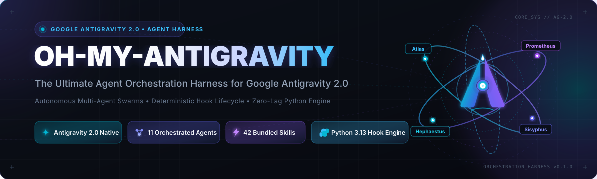
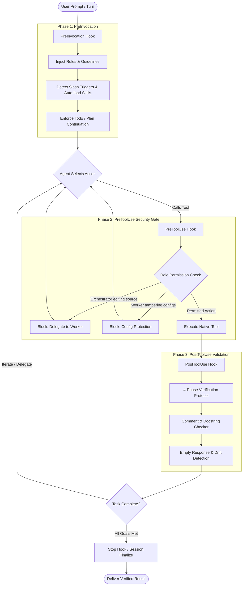
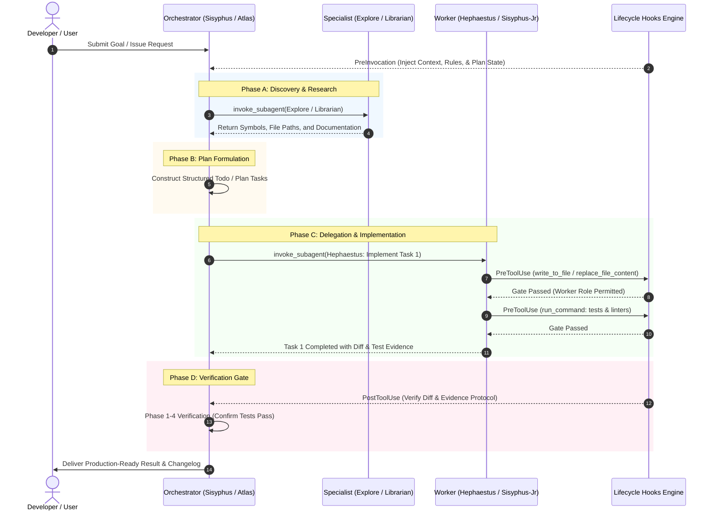

<div align="center">

[English](README.md) | [繁體中文](README.zh-TW.md)

[](https://github.com/HengWeiBin/oh-my-antigravity)
[](https://www.python.org/)
[](LICENSE)
[](https://github.com/HengWeiBin/oh-my-antigravity/actions)
[](https://github.com/HengWeiBin/oh-my-antigravity/releases)

</div>

---

## Overview

**Oh-My-Antigravity** is the premier multi-agent orchestration harness engineered specifically for **Google Antigravity 2.0**.

Ported and redesigned from [`code-yeongyu/oh-my-openagent`](https://github.com/code-yeongyu/oh-my-openagent), `oh-my-antigravity` transforms Antigravity into a coordinated software engineering team. It features a unified, zero-overhead Python lifecycle hook engine, strict role-based permission boundaries, and 11 specialized agent personas equipped with 42 turnkey domain skills.

### Key Pillars

- **Conductor Mindset**: Main orchestrators (`sisyphus`, `atlas`, `prometheus`) direct architecture, maintain plans, and delegate tasks without polluting source code directly.
- **Strict Role Permissions**: High-level orchestrators are blocked from mutating source code directly, while worker agents (`hephaestus`, `sisyphus-junior`) are prohibited from tampering with configuration manifests or rules.
- **Zero-Overhead Hook Pipeline**: Built entirely on standard Python 3.13 libraries, hooks run synchronously with sub-millisecond overhead and zero runtime pip dependencies.
- **4-Phase Verification Protocol**: Guarantees that code implementations are never marked finished until files are inspected, tests pass, QA verification is conducted, and exit gates are satisfied.

---

## Quickstart & Installation

Choose one of three installation methods depending on your environment.

### Method 1: Official Antigravity CLI (Recommended)

Install directly through the Antigravity plugin manager:

```bash
agy plugin install https://github.com/HengWeiBin/oh-my-antigravity.git
```

Verify installation:

```bash
agy plugin list
```

---

### Method 2: One-Line Automated Installer

Run the automated installer script to verify prerequisites, install dependencies, and configure the plugin path automatically.

#### macOS & Linux

```bash
curl -fsSL https://raw.githubusercontent.com/HengWeiBin/oh-my-antigravity/main/install.sh | bash
```

#### Windows (PowerShell)

```powershell
irm https://raw.githubusercontent.com/HengWeiBin/oh-my-antigravity/main/install.ps1 | iex
```

Both installers automatically verify that **Python 3.13+** and **Git** are present before completing the setup.

---

### Method 3: Manual Installation (Git Clone)

#### Global Installation (User Configuration)

Deploy user-wide across all Antigravity workspaces:

```bash
# macOS / Linux
git clone https://github.com/HengWeiBin/oh-my-antigravity.git ~/.gemini/config/plugins/oh-my-antigravity

# Windows (PowerShell)
git clone https://github.com/HengWeiBin/oh-my-antigravity.git "$HOME\.gemini\config\plugins\oh-my-antigravity"
```

#### Workspace-Local Installation

Deploy isolated to a single project workspace:

```bash
git clone https://github.com/HengWeiBin/oh-my-antigravity.git <workspace>/.agents/plugins/oh-my-antigravity
```

---

## Architecture & Hook Engine

Antigravity invokes `oh-my-antigravity` through a multi-phase interceptor pipeline configured in [`hooks.json`](hooks.json). Every hook is an isolated Python script reading JSON payloads from `stdin` and emitting validated directives to `stdout`.

### Lifecycle Phases

1. **PreInvocation (`scripts/pre_invocation.py`)**:
   - Executes at the beginning of each user turn.
   - Injects behavioral rules ([`rules/oh-my-openagent-rules.md`](rules/oh-my-openagent-rules.md)), discovers local directory agent profiles, enforces todo/plan continuation, and dynamically mounts requested skills matching slash-command syntax.
2. **PreToolUse (`scripts/pre_tool_use.py`)**:
   - Intercepts mutating tool operations (`write_to_file`, `replace_file_content`, `multi_replace_file_content`, `run_command`).
   - Enforces role-based permissions: orchestrators cannot edit source code directly; workers cannot modify plugin manifests or task states.
3. **PostToolUse (`scripts/post_tool_use.py`)**:
   - Fires upon completion of subagent invocations or file modifications.
   - Enforces the 4-Phase Verification Protocol, checks plan format compliance, validates source code comments via comment checker, and alerts on empty responses.
4. **Stop (`scripts/stop.py`)**:
   - Runs during session shutdown or task conclusion to clean scratch files and log session metrics.

### Hook Interception Lifecycle



### Orchestrator-Worker Delegation Model



---

## Agent Roster

`oh-my-antigravity` bundles 11 specialized agent personas, organized into three distinct tiers: Orchestrators, Workers, and Research Specialists.

| Agent | Type / Role | Model Tier | Description | Permitted Tools Scope |
|---|---|---|---|---|
| **`sisyphus`** | Lead Orchestrator | `pro` | Primary workflow coordinator. Plans, breaks down epics, delegates tasks to workers, and tracks completion. Blocked from editing source code. | `view_file`, `grep_search`, `list_dir`, `find_by_name`, `read_url_content`, `search_web`, `invoke_subagent`, `manage_task`, `define_subagent`, `manage_subagents`, `.md` / `.omo/` writes. |
| **`atlas`** | Master Orchestrator | `flash` | Relentless execution driver. Tracks multi-item todo lists and work plans, continuously delegating until all checklist tasks are 100% finished. | Read tools, web search, `invoke_subagent`, task management, `.md` / plan state updates. |
| **`prometheus`** | Strategic Planner | `flash` | Strategic planning consultant. Investigates conventions, gathers codebase facts, and synthesizes complete, decision-complete work plans. | Read tools, web search, `invoke_subagent`, task management, `.md` / plan documentation. |
| **`metis`** | Pre-Planning Consultant | `flash` | Pre-planning analyst. Scrutinizes requirements before planning starts to prevent over-engineering, scope creep, and ambiguous specifications. | Read-only inspection tools (`view_file`, `grep_search`, `list_dir`, `find_by_name`, `read_url_content`, `search_web`). |
| **`momus`** | Plan Reviewer | `flash` | Hostile plan auditor. Ruthlessly challenges assumptions, spots missing files, identifies unexecutable steps, and exposes blind spots. | Read-only inspection tools (`view_file`, `grep_search`, `list_dir`, `find_by_name`, `read_url_content`, `search_web`). |
| **`hephaestus`** | Deep Worker | `flash` (Pro Capable) | Senior staff autonomous engineer. Handles complex, multi-step implementations, architectural refactors, and test suites end-to-end. | Full tool access: all read tools, file edits (`write_to_file`, `replace_file_content`), command execution (`run_command`), subagents. Config-protected. |
| **`sisyphus-junior`** | Task Executor | `flash` | Fast, disciplined executor focused on bite-sized implementations, bug fixes, and surgical edits with strict adherence to instructions. | Full tool access: all read tools, file edits (`write_to_file`, `replace_file_content`), command execution (`run_command`). Config-protected. |
| **`explore`** | Contextual Search | `flash` | Lightning-fast codebase researcher. Locates symbol definitions, implementation files, and usages without modifying files. | Read-only exploration (`view_file`, `grep_search`, `list_dir`, `find_by_name`, `read_url_content`, `search_web`). |
| **`librarian`** | Docs & OSS Specialist | `flash` | External research specialist. Fetches official documentation, external package references, and open-source implementation patterns. | Read-only web and local inspection (`view_file`, `grep_search`, `list_dir`, `find_by_name`, `read_url_content`, `search_web`). |
| **`oracle`** | Architecture Advisor | `pro` | Strategic technical advisor. Provides deep reasoning for architectural trade-offs, deadlock resolution, security postures, and system debugging. | Read-only analytical tools (`view_file`, `grep_search`, `list_dir`, `find_by_name`, `read_url_content`, `search_web`). |
| **`multimodal-looker`**| Media Analyst | `flash` | Visual inspector for UI screenshots, architecture diagrams, PDF documentation, and visual regression artifacts. | Read-only media & file inspection (`view_file`, `grep_search`, `list_dir`, `find_by_name`, `read_url_content`, `search_web`). |

---

## Bundled Skills Catalog

`oh-my-antigravity` includes **42 production skills**. Any skill can be auto-loaded into an agent turn using slash-command syntax (e.g., `/debugging` or `/programming`).

### 1. Planning & Strategy

| Command | Skill | Description |
|---|---|---|
| `/hyperplan` | `hyperplan` | Hostile multi-agent planning orchestrating 5 competing perspectives for battle-tested blueprints. |
| `/ulw-plan` | `ulw-plan` | Explore-first planning engine (Prometheus) producing decision-complete execution plans before coding. |
| `/teammode` | `teammode` | Orchestrates parallel cooperating subagent workers for concurrent workflow execution. |
| `/domain-modeling` | `domain-modeling` | Formulates ubiquitous domain language, architectural decision records, and boundaries. |
| `/codebase-design` | `codebase-design` | Principles for deep module interfaces, minimal surface areas, and testable seams. |
| `/start-work` | `start-work` | Executes Prometheus work plans with boulder state tracking and Stop-hook resumption. |

### 2. Engineering & Modernization

| Command | Skill | Description |
|---|---|---|
| `/programming` | `programming` | Modern strict typing (.py, .rs, .ts, .go), parse-don't-validate, zero unwrap/panic, 250 LOC ceiling. |
| `/refactor` | `refactor` | Intelligent code modernization, structural refactoring, and simplification. |
| `/remove-ai-slops` | `remove-ai-slops` | Purges repetitive AI code smells, verbose boilerplate, and oversized modules locked by tests. |
| `/remove-deadcode` | `remove-deadcode` | Safely detects and purges unused code backed by LSP validation and atomic commits. |
| `/ast-grep` | `ast-grep` | AST-aware structural search and deterministic codemods across 25 programming languages. |
| `/tdd` | `tdd` | Test-Driven Development workflow enforcing red-green-refactor cycles and regression locks. |
| `/prototype` | `prototype` | Rapid throwaway prototyping to validate experimental designs and interface ergonomics. |

### 3. Verification, QA & Debugging

| Command | Skill | Description |
|---|---|---|
| `/visual-qa` | `visual-qa` | Visual verification across responsive screen widths, pixel diffs, and terminal UI layouts. |
| `/review-work` | `review-work` | Nuclear 5-agent post-implementation review gate covering correctness, security, and quality. |
| `/pre-publish-review` | `pre-publish-review`| 16-agent release barrier analyzing all unpublished changes prior to distribution. |
| `/debugging` | `debugging` | Hypothesis-driven debugging loop forming ≥3 orthogonal hypotheses with failing regression tests. |
| `/diagnosing-bugs` | `diagnosing-bugs` | Systematic diagnostic investigation loop for hard defects and performance regressions. |
| `/comment-checker` | `comment-checker` | Intercepts code modifications to flag misleading, stale, or superfluous code comments. |

### 4. Browser Automation

| Command | Skill | Description |
|---|---|---|
| `/agent-browser` | `agent-browser` | Headless browser driver for web testing, form completion, and DOM extraction. |
| `/dev-browser` | `dev-browser` | Persistent-session browser automation for interactive testing and stateful workflows. |
| `/ultimate-browsing` | `ultimate-browsing` | Stealth browser automation with WAF/bot bypass, TLS impersonation, and anti-scraping evasion. |
| `/playwright-cli` | `playwright-cli` | Playwright CLI automation runner for end-to-end browser test execution and diagnostics. |

### 5. Git, Releases & Triage

| Command | Skill | Description |
|---|---|---|
| `/git-master` | `git-master` | Atomic git commits, clean interactive rebasing, branch squashing, and bisect search. |
| `/git-sync-upstream` | `git-sync-upstream` | Linear sync with upstream repositories via rebase and automatic fork alignment. |
| `/github-triage` | `github-triage` | Read-only triage for GitHub issues and PRs with evidence-backed Markdown reports. |
| `/work-with-pr` | `work-with-pr` | End-to-end PR workflow inside isolated task worktrees with CI gates and automatic merging. |
| `/publish` | `publish` | Automated release pipeline triggering GitHub Actions and verifying deployment artifacts. |
| `/whats-new` | `whats-new` | Formats standardized changelog release notes and synchronizes README update logs. |
| `/get-unpublished-changes` | `get-unpublished-changes` | Computes diffs between HEAD and published package registry versions. |

### 6. Antigravity System Tools & Extended Specialists

| Command | Skill | Description |
|---|---|---|
| `/antigravity-hooks` | `antigravity-hooks` | Guide and best practices for creating, configuring, and testing Antigravity hooks. |
| `/antigravity-subagents`| `antigravity-subagents`| Blueprint for subagent definitions, YAML frontmatter, tool whitelists, and lifecycle states. |
| `/lsp` | `lsp` | Language Server Protocol diagnostics, symbol navigation, and rename verification. |
| `/lsp-setup` | `lsp-setup` | Language server configuration and installation across 20+ language environments. |
| `/rules` | `rules` | Behavioral rule injection engine and workspace configuration inspector. |
| `/init` | `init` | Bootstraps project root `AGENTS.md` instruction indexes for AI engineering teams. |
| `/init-deep` | `init-deep` | Generates hierarchical multi-level `AGENTS.md` architecture guides. |
| `/call-atlas` | `call-atlas` | Direct invocation trigger routing execution tasks directly to Atlas orchestrator. |
| `/call-prometheus` | `call-prometheus` | Direct invocation trigger routing architectural planning to Prometheus. |
| `/coding-agent-sessions`| `coding-agent-sessions`| Searches and reconstructs past agent transcripts, session IDs, and context logs. |
| `/security-research` | `security-research` | Multi-agent vulnerability hunting, threat modeling, and exploitability verification. |
| `/tech-debt-audit` | `tech-debt-audit` | 9-dimensional technical debt assessment producing prioritized remediation ledgers. |

---

## Configuration & Customization

### Plugin Manifest (`plugin.json`)

The plugin manifest declares metadata loaded by Antigravity:

```json
{
  "name": "oh-my-antigravity",
  "version": "0.1.0",
  "description": "The ultimate agent orchestration harness for Google Antigravity 2.0, ported from oh-my-openagent.",
  "logo": "assets/logo.svg"
}
```

- **`name`**: Unique plugin identifier.
- **`version`**: Semantic versioning of the installed package.
- **`description`**: Summary displayed in Antigravity plugin listings.
- **`logo`**: Path to the vector brand emblem (`assets/logo.svg`).

### Lifecycle Routing (`hooks.json`)

Configures which lifecycle events and tool matchers trigger interceptor scripts:

```json
{
  "hooks": {
    "PreInvocation": [
      {
        "type": "command",
        "command": "python scripts/pre_invocation.py",
        "timeout": 8
      }
    ],
    "PreToolUse": [
      {
        "matcher": "^(write_to_file|replace_file_content|multi_replace_file_content|run_command)$",
        "hooks": [
          {
            "type": "command",
            "command": "python scripts/pre_tool_use.py",
            "timeout": 5
          }
        ]
      }
    ],
    "PostToolUse": [
      {
        "matcher": "^(invoke_subagent|write_to_file|replace_file_content|multi_replace_file_content)$",
        "hooks": [
          {
            "type": "command",
            "command": "python scripts/post_tool_use.py",
            "timeout": 5
          }
        ]
      }
    ],
    "Stop": [
      {
        "type": "command",
        "command": "python scripts/stop.py",
        "timeout": 5
      }
    ]
  }
}
```

---

## Contributing

We welcome contributions from the community! Check out our comprehensive [`CONTRIBUTING.md`](CONTRIBUTING.md) guide for details on:

- Setting up the local environment with `uv` and Python 3.13.
- Running test suites: `uv run pytest scripts/tests/`
- Running linters and formatters: `uv run ruff check scripts/`
- Authoring custom subagents and defining YAML frontmatter.
- Creating modular skills and adhering to standard library runtime constraints.

---

## Acknowledgments & Credits

`oh-my-antigravity` is derived and ported from the outstanding work on [`oh-my-openagent`](https://github.com/code-yeongyu/oh-my-openagent) created by [@code-yeongyu](https://github.com/code-yeongyu). We express our sincere gratitude to code-yeongyu and the open-source community for pioneering multi-agent orchestration patterns and developer workflows.

---

## License

This project is licensed under the [MIT License](LICENSE).
Portions derived from `oh-my-openagent`, Copyright (c) 2024–2026 code-yeongyu.
