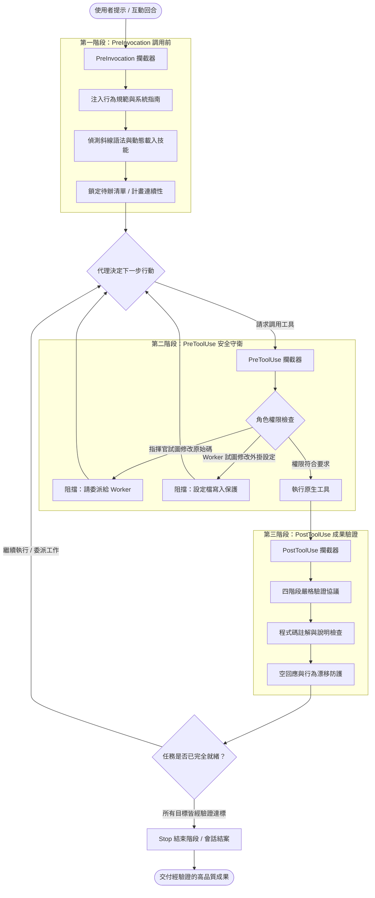
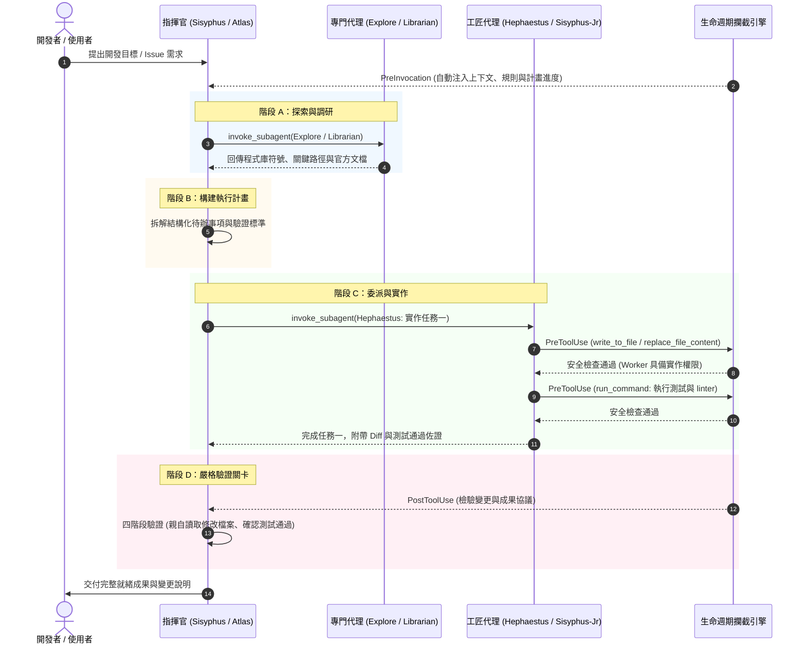

<div align="center">

[English](README.md) | [繁體中文](README.zh-TW.md)

[](https://github.com/HengWeiBin/oh-my-antigravity)
[](https://www.python.org/)
[](LICENSE)
[](https://github.com/HengWeiBin/oh-my-antigravity/actions)
[](https://github.com/HengWeiBin/oh-my-antigravity/releases)

</div>

---

## 專案概述

**Oh-My-Antigravity** 是專為 **Google Antigravity 2.0** 量身打造的頂級多代理協同調度框架（Multi-Agent Orchestration Harness）。

本專案移植並重構自 [`code-yeongyu/oh-my-openagent`](https://github.com/code-yeongyu/oh-my-openagent)，將 Antigravity 升級為一支分工明確、紀律嚴明的全功能軟體工程團隊。系統具備統一且零額外開銷的 Python 生命週期攔截器引擎（Lifecycle Hook Engine）、基於角色的嚴格權限防護邊界，以及內建 42 項隨附領域技能的 11 位專門代理角色。

### 核心特色

- **指揮官思維（Conductor Mindset）**：主指揮官代理（`sisyphus`、`atlas`、`prometheus`）專注於高層次架構規劃、待辦管理與任務指派，嚴格禁止直接修改程式原始碼，以確保全域視角。
- **嚴格的角色權限邊界（Strict Role Permissions）**：高層調度代理無權直接修改程式碼，而負責實作的工匠代理（`hephaestus`、`sisyphus-junior`）則被限制無法篡改外掛設定清單或規則文件。
- **零額外負擔攔截管線（Zero-Overhead Hook Pipeline）**：完全基於 Python 3.13 標準程式庫開發，以毫秒級的速度同步執行攔截，無須安裝任何第三方執行階段 pip 依賴。
- **四階段嚴格驗證協議（4-Phase Verification Protocol）**：嚴禁僅憑內部猜測宣告完成；所有程式碼改動必須依序通過檔案實質檢閱、自動化測試、實際品質驗證與關卡審核。

---

## 快速上手與安裝指南

根據您的開發環境與偏好，選擇以下三種安裝方式之一。

### 方法一：官方 Antigravity CLI 安裝（推薦）

直接透過 Antigravity 內建外掛管理器進行安裝：

```bash
agy plugin install https://github.com/HengWeiBin/oh-my-antigravity.git
```

驗證安裝狀態：

```bash
agy plugin list
```

---

### 方法二：一鍵自動化安裝腳本

執行跨平台自動安裝腳本，將自動驗證先決條件、配置外掛路徑並完成安裝。

#### macOS 與 Linux

```bash
curl -fsSL https://raw.githubusercontent.com/HengWeiBin/oh-my-antigravity/main/install.sh | bash
```

#### Windows（PowerShell）

```powershell
irm https://raw.githubusercontent.com/HengWeiBin/oh-my-antigravity/main/install.ps1 | iex
```

雙平台安裝腳本均會自動檢驗環境中是否已就緒 **Python 3.13+** 與 **Git**。

---

### 方法三：手動 Git Clone 安裝

#### 全域使用者安裝（全工作區通用）

將外掛部署至個人使用者設定目錄，適用於本機所有 Antigravity 工作區：

```bash
# macOS / Linux
git clone https://github.com/HengWeiBin/oh-my-antigravity.git ~/.gemini/config/plugins/oh-my-antigravity

# Windows (PowerShell)
git clone https://github.com/HengWeiBin/oh-my-antigravity.git "$HOME\.gemini\config\plugins\oh-my-antigravity"
```

#### 專案工作區個別安裝

僅將外掛隔離部署於單一特定專案工作區：

```bash
git clone https://github.com/HengWeiBin/oh-my-antigravity.git <工作區路徑>/.agents/plugins/oh-my-antigravity
```

---

## 架構與生命週期攔截引擎

Antigravity 透過在 [`hooks.json`](hooks.json) 中宣告的路由規則，在關鍵執行階段調用 `oh-my-antigravity` 的攔截器。每個攔截器皆為獨立的 Python 腳本，透過標準輸入（`stdin`）接收 JSON 酬載，並經由標準輸出（`stdout`）回傳驗證與上下文擴展指令。

### 生命週期階段

1. **對話調用前階段（PreInvocation, `scripts/pre_invocation.py`）**：
   - 在每個使用者互動回合（Turn）開始時執行。
   - 自動注入行為規範（[`rules/oh-my-openagent-rules.md`](rules/oh-my-openagent-rules.md)）、掃描工作區代理設定、維持待辦計畫進度，並偵測斜線指令語法動態載入相應技能。
2. **工具執行前階段（PreToolUse, `scripts/pre_tool_use.py`）**：
   - 攔截變更類型的工具操作（`write_to_file`、`replace_file_content`、`multi_replace_file_content`、`run_command`）。
   - 實施基於角色的權限守衛：調度指揮官無法直接改動原始碼；工匠代理無法篡改系統設定與任務清單。
3. **工具執行後階段（PostToolUse, `scripts/post_tool_use.py`）**：
   - 在子代理調用結束或檔案寫入完成時觸發。
   - 嚴格執行四階段驗證協議、檢查計畫格式完整度、分析註解品質，並防止空回應漂移。
4. **結束階段（Stop, `scripts/stop.py`）**：
   - 在對話結束或任務終止時清理暫存資料並輸出執行摘要指標。

### Hook 攔截生命週期流程圖



### 指揮官與工作代理協調模型時序圖



---

## 代理角色矩陣

`oh-my-antigravity` 內建 11 位專職代理角色，分為三大核心類別：調度指揮官（Orchestrators）、實作工匠（Workers）以及研究專員（Research Specialists）。

| 代理名稱 | 角色類別 | 推薦模型等級 | 職責與專長說明 | 允許工具權限範圍 |
|---|---|---|---|---|
| **`sisyphus`** | 總架構與主調度官 | `pro` | 主要工作流程指揮官。負責架構拆解、計畫擬定、工作委派與進度追蹤。嚴格禁止直接編輯原始碼。 | `view_file`、`grep_search`、`list_dir`、`find_by_name`、`read_url_content`、`search_web`、`invoke_subagent`、`manage_task`、`define_subagent`、`manage_subagents`、`.md` / `.omo/` 寫入。 |
| **`atlas`** | 總調度執行官 | `flash` | 不屈不撓的進度推動者。針對待辦清單與複雜計畫進行持續推進與分發，直到所有項目 100% 驗證完成。 | 唯讀探索工具、網路搜尋、`invoke_subagent`、任務管理、`.md` / 計畫狀態更新。 |
| **`prometheus`** | 策略規劃顧問 | `flash` | 前期規劃專家。專門負責分析專案慣例、探索程式碼結構，並產出決策完備、可直接執行的結構化實作計畫。 | 唯讀探索工具、網路搜尋、`invoke_subagent`、任務管理、`.md` / 計畫文件維護。 |
| **`metis`** | 前期需求顧問 | `flash` | 前置規劃分析師。在計畫正式建立前深入檢驗使用者需求，消除過度工程、範圍蔓延與模糊假設。 | 唯讀檢視工具（`view_file`、`grep_search`、`list_dir`、`find_by_name`、`read_url_content`、`search_web`）。 |
| **`momus`** | 計畫嚴格審查員 | `flash` | 批判性計畫審查專家。專門挑剔計畫中的邏輯盲點、遺漏路徑、不可執行的步驟與潛在架構隱患。 | 唯讀檢視工具（`view_file`、`grep_search`、`list_dir`、`find_by_name`、`read_url_content`、`search_web`）。 |
| **`hephaestus`** | 深度工程工匠 | `flash`（可覆寫 Pro） | 資深自主工程工程師。專責端到端處理複雜的多步驟程式實作、大規模重構與測試套件建置。 | 完整工具權限：所有檢視工具、檔案修改（`write_to_file`、`replace_file_content`）、終端機命令（`run_command`）、子代理調用。外掛設定受保護。 |
| **`sisyphus-junior`**| 聚焦任務執行員 | `flash` | 敏捷且紀律嚴明的微型任務執行者。專精於局部 Bug 修復、單一函數實作與外科手術式精確變更。 | 完整工具權限：所有檢視工具、檔案修改（`write_to_file`、`replace_file_content`）、終端機命令（`run_command`）。外掛設定受保護。 |
| **`explore`** | 程式碼情境檢索專員 | `flash` | 毫秒級程式庫探索專家。專精於快速定位符號定義、實作檔案與調用關聯，不修改任何檔案。 | 唯讀探索（`view_file`、`grep_search`、`list_dir`、`find_by_name`、`read_url_content`、`search_web`）。無寫入與執行權限。 |
| **`librarian`** | 文檔與開源生態研究專員 | `flash` | 外部知識調研專家。專責查詢官方 API 文檔、外部依賴規格與開源生態優良實作範例。 | 唯讀網路與本機檢視（`view_file`、`grep_search`、`list_dir`、`find_by_name`、`read_url_content`、`search_web`）。 |
| **`oracle`** | 技術決策架構顧問 | `pro` | 具備高度推理能力的技術智庫。負責架構取捨評估、排查卡彈程序、安全性權衡與深層系統審查。 | 唯讀分析工具（`view_file`、`grep_search`、`list_dir`、`find_by_name`、`read_url_content`、`search_web`）。 |
| **`multimodal-looker`**| 視覺與多媒體分析專員 | `flash` | 視覺檢驗專才。專門解析 UI 截圖、系統架構圖、PDF 技術手冊與視覺回歸測試比對結果。 | 唯讀多媒體與文字檢視（`view_file`、`grep_search`、`list_dir`、`find_by_name`、`read_url_content`、`search_web`）。 |

---

## 隨附技能目錄

`oh-my-antigravity` 隨附 **42 項實戰技能**。在對話中輸入斜線指令（例如 `/debugging` 或 `/programming`）即可將專業指示動態掛載至代理上下文中。

### 1. 規劃與策略（Planning & Strategy）

| 指令語法 | 技能名稱 | 功能說明 |
|---|---|---|
| `/hyperplan` | `hyperplan` | 敵對式多代理交叉辯論規劃，協同 5 種極端視角淬鍊出無懈可擊的架構藍圖。 |
| `/ulw-plan` | `ulw-plan` | 探索優先規劃顧問（Prometheus），在撰寫程式碼前產出決策完備的單一執行計畫。 |
| `/teammode` | `teammode` | Antigravity 多工匠平行調度機制，主對話擔任指揮中心協同多位代理並行處理。 |
| `/domain-modeling` | `domain-modeling` | 建立專案通用領域語言、架構決策紀錄（ADR）與清晰模組邊界。 |
| `/codebase-design` | `codebase-design` | 深度模組設計方法論，專注於極簡介面、深層實作與易於測試的接縫規劃。 |
| `/start-work` | `start-work` | 執行 Prometheus 制定之計畫，整合 Boulder 狀態追蹤與 Stop 攔截中斷接續機制。 |

### 2. 工程實作與現代化（Engineering & Modernization）

| 指令語法 | 技能名稱 | 功能說明 |
|---|---|---|
| `/programming` | `programming` | 現代嚴格型別開發規範（.py、.rs、.ts、.go），落實解析取代驗證、零 panic 與 250 行上限。 |
| `/refactor` | `refactor` | 智慧型程式碼重構、現代化升級、消除冗餘與結構簡化。 |
| `/remove-ai-slops` | `remove-ai-slops` | 清除 AI 產生的冗長樣板程式碼、過度物件標記與巨大模組，並以回歸測試全面防護。 |
| `/remove-deadcode` | `remove-deadcode` | 透過 LSP 語言伺服器安全偵測並清理未使用的死碼，支援原子化提交。 |
| `/ast-grep` | `ast-grep` | 基於 AST 語法樹的跨語言（25+ 種）結構化搜尋與確定性程式碼重寫。 |
| `/tdd` | `tdd` | 測試驅動開發流程，嚴格落實「紅-綠-重構」循環與回歸測試鎖定。 |
| `/prototype` | `prototype` | 快速構建一次性原型以驗證架構假設、API 手感與狀態模型。 |

### 3. 驗證、品質保證與除錯（Verification, QA & Debugging）

| 指令語法 | 技能名稱 | 功能說明 |
|---|---|---|
| `/visual-qa` | `visual-qa` | 跨響應式尺寸、像素級差異對比與終端機 UI 排版之全方位視覺驗證。 |
| `/review-work` | `review-work` | 實作完成審查守衛，並行調用 5 位獨立子代理全方位稽核正確性、安全性與品質。 |
| `/pre-publish-review` | `pre-publish-review`| 16 位代理組成的核級發布閘門，深入分析所有未發布變更以確保零風險。 |
| `/debugging` | `debugging` | 假設驅動除錯迴圈，同時提出 ≥3 種正交假設並以可重現的失敗測試鎖定根因。 |
| `/diagnosing-bugs` | `diagnosing-bugs` | 針對棘手缺陷、非預期異常與效能衰退的系統化診斷流程。 |
| `/comment-checker` | `comment-checker` | 攔截程式修改，自動揪出過時、誤導或畫蛇添足的無效註解。 |

### 4. 瀏覽器自動化（Browser Automation）

| 指令語法 | 技能名稱 | 功能說明 |
|---|---|---|
| `/agent-browser` | `agent-browser` | 現代化無頭瀏覽器自動化驅動，支援網頁測試、表單填寫與畫面資訊萃取。 |
| `/dev-browser` | `dev-browser` | 具備持久化頁面狀態的瀏覽器互動工具，適合互動式驗證與狀態流流程。 |
| `/ultimate-browsing` | `ultimate-browsing` | 高級反爬蟲繞過技術，整合 TLS 偽裝、隱身 Chromium 與防阻擋萃取管線。 |
| `/playwright-cli` | `playwright-cli` | Playwright CLI 腳本自動化運行工具，提供端到端網頁檢驗能力。 |

### 5. Git、版本發布與分類（Git, Releases & Triage）

| 指令語法 | 技能名稱 | 功能說明 |
|---|---|---|
| `/git-master` | `git-master` | 原子化 Git 提交、互動式 Rebase、分支 Squash 合併與二分搜尋（Bisect）。 |
| `/git-sync-upstream` | `git-sync-upstream` | 線性 Rebase 同步上游原始儲存庫最新程式碼，並安全更新 GitHub Fork 分支。 |
| `/github-triage` | `github-triage` | 唯讀模式檢閱 GitHub Issue 與 PR，輸出具備具體證據與永久連結之分析報告。 |
| `/work-with-pr` | `work-with-pr` | 在獨立 Worktree 中完成實作、CI 檢驗、同行審查並最終合併之完整 PR 生命週期。 |
| `/publish` | `publish` | 自動化發布管線，觸發 GitHub Actions 並驗證發布成果。 |
| `/whats-new` | `whats-new` | 標準化發布說明生成器，自動整理更新日誌並同步至 README 記錄。 |
| `/get-unpublished-changes` | `get-unpublished-changes` | 對比 HEAD 與最新發布版本，列出各發布層之未發布改動清單。 |

### 6. Antigravity 系統工具與擴充專才（Antigravity System Tools & Extended Specialists）

| 指令語法 | 技能名稱 | 功能說明 |
|---|---|---|
| `/antigravity-hooks` | `antigravity-hooks` | Antigravity 生命週期攔截器配置、撰寫與除錯完整指南與最佳實踐。 |
| `/antigravity-subagents`| `antigravity-subagents`| 子代理設定藍圖，涵蓋 YAML 前言標頭、工具白名單與生命週期規範。 |
| `/lsp` | `lsp` | 語言伺服器協議（LSP）診斷檢查、符號定義跳轉、引用搜尋與重新命名防護。 |
| `/lsp-setup` | `lsp-setup` | 跨 20+ 種主流語言之 LSP 語言伺服器自動偵測、安裝指引與組態設定。 |
| `/rules` | `rules` | 行為規範注入引擎、專案規則解析與工作區環境設定檢查器。 |
| `/init` | `init` | 快速建立或更新儲存庫根目錄之 `AGENTS.md` 核心指引文件。 |
| `/init-deep` | `init-deep` | 初始化多層級階層式 `AGENTS.md` 知識庫，打造清晰架構導覽。 |
| `/call-atlas` | `call-atlas` | 快速調度通道，直接將多步驟執行任務分派予 Atlas 總調度官。 |
| `/call-prometheus` | `call-prometheus` | 快速規劃通道，直接將需求引導至 Prometheus 進行前置架構規劃。 |
| `/coding-agent-sessions`| `coding-agent-sessions`| 跨平台編碼代理歷史會話檢索，查詢歷史逐字稿、會話 ID 與上下文軌跡。 |
| `/security-research` | `security-research` | 多代理並行安全漏洞獵捕、威脅建模、概念驗證與可利用性實質審計。 |
| `/tech-debt-audit` | `tech-debt-audit` | 9 維度全方位技術債健康檢查，產出具備嚴重性評級之修復清單。 |

---

## 配置與客製化

### 外掛資訊清單（`plugin.json`）

外掛資訊清單用於宣告供 Antigravity 讀取之外掛基本資訊：

```json
{
  "name": "oh-my-antigravity",
  "version": "0.1.0",
  "description": "The ultimate agent orchestration harness for Google Antigravity 2.0, ported from oh-my-openagent.",
  "logo": "assets/logo.svg"
}
```

- **`name`**：外掛唯一識別名稱。
- **`version`**：目前安裝之外掛語意化版本號。
- **`description`**：在 Antigravity 外掛列表中顯示的簡短描述。
- **`logo`**：向量品牌識別標誌路徑（`assets/logo.svg`）。

### 生命週期路由表（`hooks.json`）

定義各生命週期事件觸發之執行腳本與逾時限制：

```json
{
  "hooks": {
    "PreInvocation": [
      {
        "type": "command",
        "command": "python scripts/pre_invocation.py",
        "timeout": 8
      }
    ],
    "PreToolUse": [
      {
        "matcher": "^(write_to_file|replace_file_content|multi_replace_file_content|run_command)$",
        "hooks": [
          {
            "type": "command",
            "command": "python scripts/pre_tool_use.py",
            "timeout": 5
          }
        ]
      }
    ],
    "PostToolUse": [
      {
        "matcher": "^(invoke_subagent|write_to_file|replace_file_content|multi_replace_file_content)$",
        "hooks": [
          {
            "type": "command",
            "command": "python scripts/post_tool_use.py",
            "timeout": 5
          }
        ]
      }
    ],
    "Stop": [
      {
        "type": "command",
        "command": "python scripts/stop.py",
        "timeout": 5
      }
    ]
  }
}
```

---

## 參與貢獻

我們竭誠歡迎社群的參與與貢獻！請參閱專案詳細的 [`CONTRIBUTING.md`](CONTRIBUTING.md) 貢獻指引以了解：

- 使用 `uv` 與 Python 3.13 設定本機開發環境。
- 執行自動化測試套件：`uv run pytest scripts/tests/`
- 執行程式碼排版與靜態檢查：`uv run ruff check scripts/`
- 建立自訂子代理（Subagent）與 YAML 前言規格。
- 撰寫模組化技能並遵循「標準程式庫零外部依賴」之設計約束。

---

## 鳴謝與專案傳承

`oh-my-antigravity` 源自於 [@code-yeongyu](https://github.com/code-yeongyu) 所開創的傑出開源專案 [`oh-my-openagent`](https://github.com/code-yeongyu/oh-my-openagent)。我們向 code-yeongyu 以及開源社群在探索多代理協同架構與開發者體驗創新上的先鋒貢獻致上最誠摯的謝意。

---

## 授權條款

本專案採用 [MIT 授權條款](LICENSE) 釋出。
部分程式碼衍生自 `oh-my-openagent`，版權所有 (c) 2024–2026 code-yeongyu。
