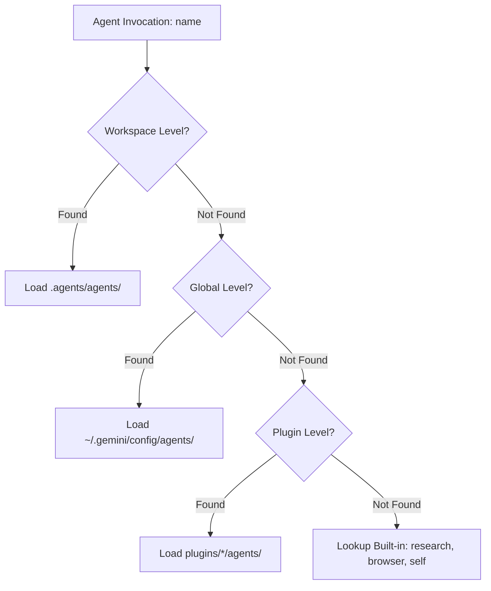
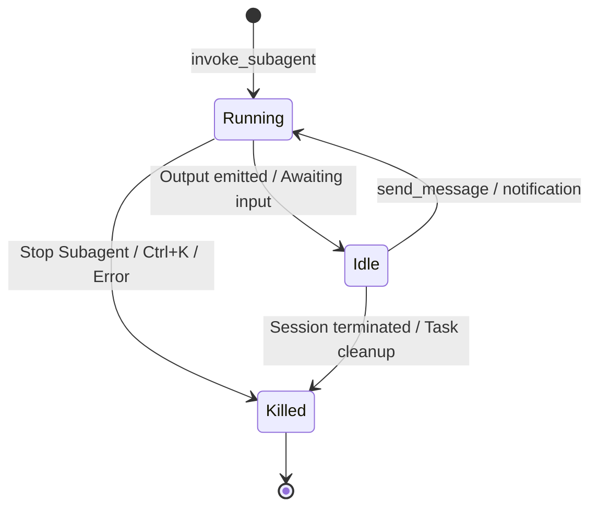
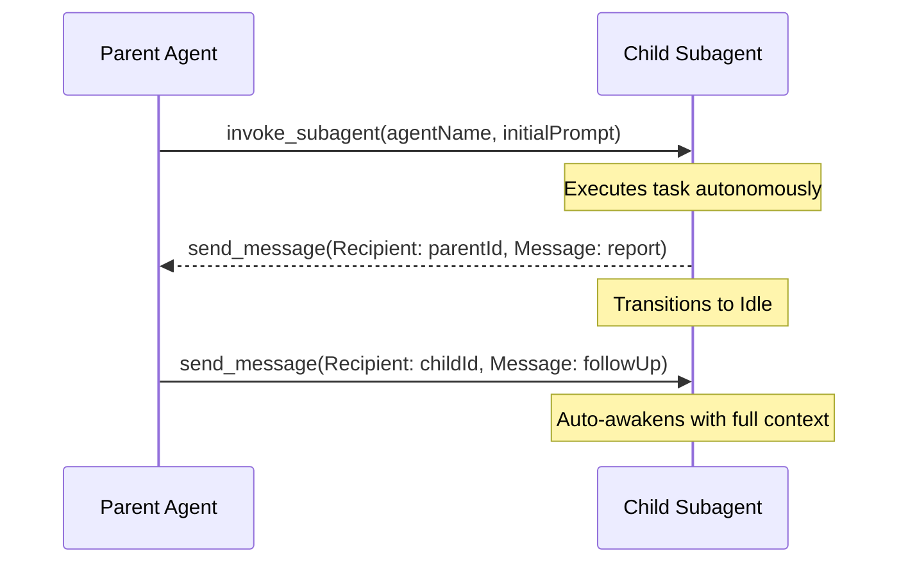

# Google Antigravity Sub-Agents: Complete Architecture, Configuration & Best Practices Guide

Sub-agents in Google Antigravity allow complex engineering tasks to be delegated to specialized, modular AI agents with isolated contexts, explicit tool permissions, and customized system instructions.

This guide provides the complete specification for sub-agent discovery, package structures, frontmatter configuration, lifecycle management, communication protocols, permission inheritance, and prompt design.

---

## 1. Agent Discovery Architecture & Package Formats

Antigravity resolves agent definitions from three hierarchical tiers. When an agent is invoked by name, Antigravity searches these tiers in order of precedence: **Workspace > Global > Plugin**.



### Discovery Paths

| Scope | Discovery Path | Description |
|---|---|---|
| **Workspace** | `.agents/agents/<name>.md`<br>`.agents/agents/<name>/agent.md` | Project-specific agents committed to repository version control. Overrides global and plugin agents with identical names. |
| **Global** | `~/.gemini/config/agents/<name>.md`<br>`~/.gemini/config/agents/<name>/agent.md` | User-wide agents available across all projects and workspaces. On Windows: `%USERPROFILE%\.gemini\config\agents\`. |
| **Plugin** | `plugins/<plugin_name>/agents/<name>.md`<br>`plugins/<plugin_name>/agents/<name>/agent.md` | Bundled agents distributed with installed Antigravity plugins. |

### Supported Package Formats

Antigravity supports two static package formats:

1. **Single-File Format (`<name>.md`)**
   - The entire agent definition—YAML frontmatter and Markdown system prompt—is contained within a single `.md` file.
   - Best for lightweight, self-contained agents.
   - Example: `.agents/agents/explore.md`

2. **Directory Package Format (`<name>/agent.md`)**
   - The entrypoint definition resides in `agent.md` within a folder named after the agent.
   - Best for complex sub-agents requiring auxiliary documentation, reference schemas, local templates, or sub-assets.
   - Example: `.agents/agents/reviewer/agent.md`

### Dynamic Sub-Agent Definition (`define_subagent`)

In addition to static Markdown files, agents can be registered programmatically at runtime using the `define_subagent` tool. This is useful for dynamic multi-agent task planning or ephemeral workers:

```json
{
  "name": "ephemeral-analyst",
  "description": "Analyzes memory dumps and benchmark profiles on demand.",
  "system_prompt": "<identity>You are a performance profiling specialist...</identity>",
  "enable_write_tools": false,
  "enable_mcp_tools": true,
  "enable_subagent_tools": false
}
```

---

## 2. Complete YAML Frontmatter Specification

Static agent definitions begin with a YAML frontmatter block enclosed between triple dashes (`---`). The table below outlines all official frontmatter fields:

| Field | Type | Default | Description |
|---|---|---|---|
| `name` | `string` | **Required** | Unique identifier used when invoking via `invoke_subagent` or selecting from UI menus. |
| `description` | `string` | **Required** | Detailed description of the agent's role, triggers, and capabilities. Used by orchestrators for autonomous routing. |
| `tools` | `string[]` | `[]` | Explicit whitelist of permitted tools. **If omitted, no file system or execution tools are available!** |
| `mainAgent` | `boolean` | `true` | Whether the agent appears as a selectable primary orchestrator in the main chat interface. Set to `false` for dedicated worker subagents. |
| `subagent` | `boolean` | `true` | Whether the agent can be spawned as a child sub-agent via `invoke_subagent`. Set to `false` for main-only controllers. |
| `model` | `string` | `inherit` | Model selection for agent reasoning: `inherit`, `flash`, or `pro`. (See model notes below). |
| `commandExecutionPolicy` | `string` | `sandbox` | Terminal command execution policy: `off`, `auto`, `eager`, `sandbox`. |
| `mcpServers` | `object[]` | `[]` | Scoped Model Context Protocol (MCP) servers configured specifically for this sub-agent session. |
| `enable_mcp_tools` | `boolean` | `true` | Master toggle controlling access to registered MCP tools. |
| `skills` or `plugins` | `string[]` | `[]` | Paths or names of skills (e.g. `skills/ast-grep`, `skills/debugging`) or plugin dependencies pre-loaded into context. |
| `inheritCustomizations` | `boolean` | `true` | Whether to inherit project-level rules, instructions, and skill customizations from the parent workspace. |
| `workspace` | `string` | `inherit` | Workspace isolation mode: `inherit` (same directory), `branch` (isolated branch), or `share` (git worktree). |

### Model Selection Guidelines

- **`inherit`** (Default): Adopts whichever model is driving the parent orchestrator. Recommended for consistency.
- **`flash`**: Ultra-fast execution, high throughput, and cost-efficient. Best for read-only exploration, triage, lint checking, and rapid grep searches (e.g. `explore`, `librarian`).
- **`pro`**: High reasoning capacity, advanced architectural decomposition, and complex code generation. Best for deep refactoring, architectural review, and root-cause debugging (e.g. `hephaestus`, `oracle`).
- **Note on `flash_lite` compatibility**: While `flash_lite` is supported in some tiers for ultralow latency tasks, it has tighter context windows and less reliable complex tool-calling capabilities. Avoid using `flash_lite` for agents that execute multi-step tool sequences or handle large file edits.

### Command Execution Policies (`commandExecutionPolicy`)

- **`sandbox`** (Default): Commands run inside an isolated OS container or restricted sandbox, isolating changes and protecting the host environment.
- **`auto`**: Commands are evaluated heuristically; non-destructive read operations execute directly while state-modifying actions prompt for approval.
- **`eager`**: Non-destructive commands execute immediately without pauses, maximizing speed during autonomous scripting.
- **`off`**: Terminal command execution is completely disabled for the agent.

---

## 3. Critical Known Issue: Tool Validation Hang

> [!CAUTION]
> ### Tool Validation Hang (Unmapped or Misspelled Tools)
> Antigravity performs strict handshake validation on startup for every tool listed under `tools:`.
> 
> If a sub-agent specification includes an **unmapped, non-existent, or misspelled tool name**, the subagent initialization process will **hang indefinitely** during startup validation without producing an explicit syntax or parse error.
>
> **Prevention & Troubleshooting Checklist:**
> 1. Double-check every entry in `tools:` against the official tool registry names.
> 2. Watch out for common name mismatches:
>    - ❌ `write_file` → ✅ `write_to_file`
>    - ❌ `replace_file` → ✅ `replace_file_content`
>    - ❌ `grep` / `rg` → ✅ `grep_search`
>    - ❌ `find_files` / `glob` → ✅ `find_by_name`
>    - ❌ `bash` / `terminal` → ✅ `run_command`
>    - ❌ `read_url` → ✅ `read_url_content`
> 3. If a newly created sub-agent hangs immediately after calling `invoke_subagent`, terminate it (`Ctrl+K` or UI "Stop Subagent") and audit its `tools:` list first.

---

## 4. Tool Permissions & Critical Whitelisting Rules

### The Core Tool Pitfall
Antigravity enforces a strict **Zero-Trust Default Deny** policy for sub-agents. 

Unlike the main chat agent, sub-agents **DO NOT automatically inherit default file system tools** (`view_file`, `grep_search`, `write_to_file`, etc.) unless they are explicitly enumerated in the frontmatter `tools:` whitelist.

- If you omit `tools:`, the sub-agent will only have fundamental communication tools (`send_message`).
- Capability flags (e.g. `enable_write_tools: true`) cannot substitute for explicit tool whitelisting in static markdown definitions.

### Active Workspace Dependency (Tool Stripping Warning)

> [!WARNING]
> ### Active Workspace Dependency
> Antigravity will **purposefully strip all file system tools** (both read and write) from sub-agents if the parent agent is not operating within an **Active Workspace** (a folder opened as a workspace root).
> 
> Always ensure execution takes place inside a recognized, active workspace directory before launching sub-agents.

### Standard Production Tool Sets

#### Set A: Read-Only & Research Agents (e.g., `explore`, `librarian`)
Focused on codebase search, structural inspection, and documentation retrieval without mutating project state:

```yaml
---
name: explore
description: Read-only codebase search specialist. Locates files, symbols, and architectural patterns.
mainAgent: false
subagent: true
model: flash
commandExecutionPolicy: auto
enable_mcp_tools: true
tools:
  - view_file
  - grep_search
  - list_dir
  - find_by_name
  - read_url_content
  - search_web
skills:
  - ast-grep
---
```

#### Set B: Deep Implementation & Worker Specialists (e.g., `hephaestus`, `worker`)
Equipped for end-to-end coding, refactoring, test execution, and command line verification:

```yaml
---
name: hephaestus
description: Autonomous deep worker for complex implementation, refactoring, and bug fixes.
mainAgent: false
subagent: true
model: pro
commandExecutionPolicy: sandbox
enable_mcp_tools: true
tools:
  - view_file
  - grep_search
  - list_dir
  - find_by_name
  - read_url_content
  - search_web
  - replace_file_content
  - write_to_file
  - run_command
  - manage_task
skills:
  - programming
  - debugging
---
```

#### Set C: Master Orchestrators (e.g., `atlas`, `sisyphus`)
Equipped for task decomposition, subagent delegation, and high-level workflow coordination:

```yaml
---
name: atlas
description: Master orchestrator that coordinates multiple sub-agents to complete structured plan tasks.
mainAgent: true
subagent: false
model: inherit
commandExecutionPolicy: sandbox
enable_mcp_tools: true
tools:
  - view_file
  - grep_search
  - list_dir
  - find_by_name
  - read_url_content
  - search_web
  - replace_file_content
  - write_to_file
  - run_command
  - invoke_subagent
  - manage_task
  - define_subagent
  - manage_subagents
skills:
  - start-work
  - teammode
  - ultrawork
---
```

---

## 5. Built-in Subagents

Antigravity provides three pre-configured built-in subagents accessible out of the box without requiring local Markdown definitions:

### 1. `research`
- **Purpose**: Optimized for rapid codebase exploration, symbol indexing, dependency tracing, and file navigation.
- **Capabilities**: Read-only access to workspace files, web search, URL reading, and directory trees.
- **Behavior**: Generates structured summaries without altering code or running destructive commands.

### 2. `browser`
- **Purpose**: Operates an automated, sandboxed web browser for interactive application testing, DOM inspection, user journey verification, and visual regression checks.
- **Access**: Invokable programmatically via `invoke_subagent` or interactively in chat using `/browser`.
- **Capabilities**: Navigates URLs, clicks elements, fills inputs, takes screenshots, and evaluates frontend console outputs.

### 3. `self`
- **Purpose**: Direct, recursive clone of the calling agent.
- **Capabilities**: Inherits the exact system prompt, toolsets, model tier, and configuration of the caller.
- **Use Cases**: Decomposing a large list of homogeneous tasks into concurrent worker threads without declaring custom agent definition files.

---

## 6. Subagent Lifecycle, States & CLI Controls

### Lifecycle States

Every subagent exists in one of three states:



1. **`Running`**:
   - The subagent is actively executing code, reasoning, or calling tools.
   - Can be stopped at any time via the GUI **"Stop Subagent"** button or CLI keyboard shortcuts (`Ctrl+K` or `k`).
2. **`Idle`**:
   - The subagent has concluded its current turn and is suspended waiting for incoming instructions.
   - Context retention: All conversation history, scratchpad notes, and memory remain preserved in RAM.
   - Reactive wake-up: Automatically wakes to `Running` state upon receiving a message via `send_message` or a timer notification.
3. **`Killed`**:
   - The subagent execution has been terminated.
   - Resource cleanup: Ephemeral workspaces and git worktrees are automatically torn down and removed.
   - Audit trail: Full conversation transcripts and generated artifacts remain saved for post-run analysis.

### CLI Shortcuts & Controls

| Shortcut / Control | Environment | Action |
|---|---|---|
| `Alt+J` | Terminal CLI | View active subagents and switch active focus between agent console views. |
| `Ctrl+K` or `k` | Terminal CLI | Stop / terminate the currently selected subagent. |
| **"Stop Subagent"** | Web / GUI UI | Immediately halts child subagent execution. |

---

## 7. Inter-Agent Communication & Nesting Architecture

### Communication Protocol



1. **Invocation**: The parent starts a subagent session via `invoke_subagent` specifying the agent name and initial task prompt.
2. **Result Reporting**: The child subagent **MUST** use `send_message` with `Recipient: <caller_id>` to deliver reports, findings, and artifact links back to the parent.
   > [!IMPORTANT]
   > Subagents running in non-root contexts must communicate via `send_message`. Standard text output emitted outside `send_message` is not forwarded to the caller.
3. **Reactive Wake-Up**: When a parent sends a message to an `Idle` subagent, the child automatically resumes execution with full context history preserved. Polling loops with `manage_task` or manual sleeps are neither needed nor allowed.
4. **Shared Transcripts**: All agents within the same execution tree can inspect each other's conversation logs and generated artifacts, allowing cross-agent auditing and preventing redundant operations.

### Nesting Depth Limit

- Antigravity enforces a strict **maximum nesting depth of 10 levels** beneath the primary orchestrator:
  $$\text{Root Main Agent (Depth 0)} \rightarrow \text{Subagent (Depth 1)} \rightarrow \dots \rightarrow \text{Subagent (Depth 10)}$$
- Attempting to spawn subagents beyond Depth 10 will fail with a recursion depth limit error. Design workflows to prefer flat fan-out architectures (orchestrator with $N$ parallel workers) over deep recursive cascades.

---

## 8. Permissions & Configuration Inheritance

### Inherited Scopes
Child subagents automatically inherit key security boundaries from the parent session:
- **Terminal Execution Prefixes**: Command whitelists/blacklists established at the session root apply downstream.
- **File System Scopes**: Boundary limits (allowed read/write directories) are strictly enforced across all child processes.
- **Sandbox Settings**: If the parent runs under containerized sandboxing, subagents cannot break out to native host privileges.

### Permission Bubbling
When a subagent attempts an action that exceeds its automatic authorization (e.g. running an unapproved terminal command, modifying sensitive config files, or initiating external network connections):
- The permission prompt **bubbles up directly to the primary user chat interface**.
- The child subagent enters an idle wait state until the user approves or rejects the prompt in the main UI.
- Subagents cannot silently bypass user consent requirements.

### Workspace Isolation Modes (`workspace:`)

| Mode | Behavior | Best Used For |
|---|---|---|
| `inherit` *(Default)* | Directly operates in the parent's current workspace directory. | Fast, collaborative editing on standard tasks. |
| `branch` | Spawns the agent inside an isolated git branch. | Experimental refactoring, breaking changes, or speculative bug fixes. |
| `share` | Creates a lightweight shared workspace using git worktrees. | Concurrent multi-agent editing without git branch collisions. |

The parent orchestrator maintains full read/write visibility into subagent workspaces across all modes.

---

## 9. Multi-Agent Teamwork (`/teamwork-preview`)

> [!NOTE]
> `/teamwork-preview` is an advanced collaboration feature available on the **Ultra plan**.

Multi-Agent Teamwork allows multiple autonomous agents to cooperate simultaneously on shared repositories:
- **Shared Blackboard / Task Graph**: Agents claim, coordinate, and execute subtasks in parallel without step-by-step orchestrator intervention.
- **Conflict-Free Synchronization**: Built-in AST-level reconciliation and git worktree isolation prevent overlapping file overwrite errors.
- **Activation**: Initiate a collaborative teamwork session directly in chat using the `/teamwork-preview` command.

---

## 10. Sub-Agent System Prompt Structure & Production Template

Sub-agent markdown bodies define the agent's persona, constraints, and execution workflow. Structure system prompts using semantic XML blocks to maximize reasoning clarity.

### Recommended XML Structure

```markdown
<identity>
Define role, persona, specialty, and execution boundaries.
</identity>

<TOOL_CALL_MANDATE>
Enforce aggressive tool usage. Sub-agents MUST inspect real file contents 
rather than guessing or relying on hallucinated patterns.
</TOOL_CALL_MANDATE>

<mission>
State primary objective, expected outputs, and exact definition of done.
</mission>

<scope_and_design_constraints>
Define strict positive and negative boundaries:
- What files may be modified.
- What directories are strictly off-limits.
- Architectural guidelines (e.g. no new external dependencies).
</scope_and_design_constraints>

<workflow>
Provide step-by-step execution phases:
1. Explore: Inspect files, locate definitions, understand call sites.
2. Plan: Formulate atomic change strategy.
3. Execute: Apply changes with targeted replace or write tools.
4. Verify: Run linters, test commands, or type checks.
5. Report: Summarize changed files and verification results.
</workflow>

<termination>
Mandate explicit completion behavior: emit final report via send_message and stop.
Do not poll or wait indefinitely.
</termination>
```

### Complete Production Agent Example (`agents/refactor-specialist.md`)

```markdown
---
name: refactor-specialist
description: Specialized worker for executing atomic code refactoring and dead-code removal.
mainAgent: false
subagent: true
model: pro
commandExecutionPolicy: sandbox
inheritCustomizations: true
tools:
  - view_file
  - grep_search
  - list_dir
  - find_by_name
  - replace_file_content
  - write_to_file
  - run_command
skills:
  - ast-grep
  - debugging
---

<identity>
You are an expert refactoring specialist. Your role is to perform safe, atomic code transformations, simplify architecture, and eliminate dead code without altering external behavior.
</identity>

<TOOL_CALL_MANDATE>
- ALWAYS read and inspect full file contents with `view_file` before making modifications.
- NEVER assume line numbers or content without fresh tool output.
- Use `replace_file_content` for surgical modifications.
</TOOL_CALL_MANDATE>

<mission>
Execute the requested refactoring tasks cleanly, preserve all existing tests, and verify integrity via type checks and test suites.
</mission>

<scope_and_design_constraints>
- Modify ONLY files explicitly within the refactoring scope.
- Maintain full backward compatibility unless breaking changes were explicitly requested.
- Run project test suites after changes using `run_command`.
</scope_and_design_constraints>

<workflow>
1. **Analyze**: Use `grep_search` and `view_file` to locate all references and call sites.
2. **Refactor**: Apply precise edits using `replace_file_content`.
3. **Verify**: Execute tests via `run_command` (e.g. `npm test`, `pytest`).
4. **Report**: Use `send_message` to report all modified files, test outputs, and diff summaries back to the caller.
</workflow>

<termination>
Once verification passes, send the final summary report via `send_message` and cease tool calling.
</termination>
```
